# Step-by-step to get started with **React.Js**

## **Step 1**

### Go through your projects folder path, click the right button mouse, and select `Git Bash Here`.

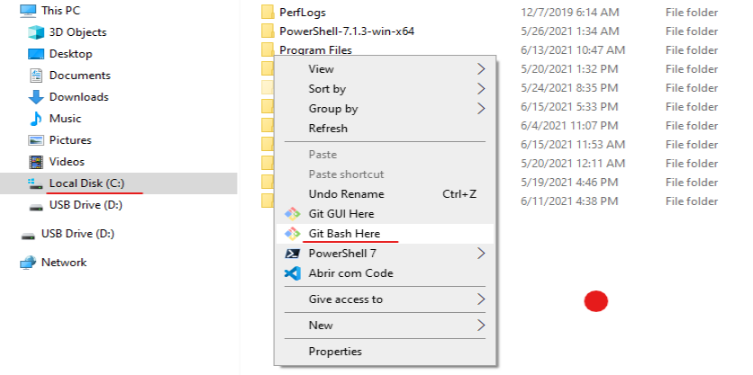

## **Step 2**

### Once the `GitBash` terminal is open, let's go to the following commands:

Run this command to create the files, folders, and the needed dependencies for the React application.

```js
npx create-react-app 'react_project_x_v2'
```


#

#

#

### Note:

The command above comes up with a new folder created from scratch called `react_project_x_v2` along with the React files including their dependencies. This folder must be specified between quotes and only have lower cases, but considering you have already a specific folder and this folder is void, open it and call `Git Bash Here`, or go through the folder's path with `cd` commands.

`Ex.1:` The command `mkdir` means make directory. After `ENTER` on this command, you'll see it being created simultaneously.

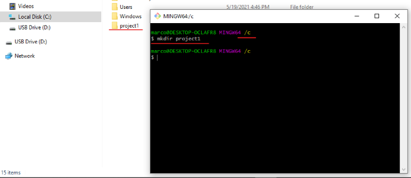

`Ex.2:` The command `cd` means "change directory", which allows you navigating to one level below the current directory; `double tab` to show the available options; `cd ..` to go one level back.\
No matter where you are, the command `cd` will aways go to the `~` , that means you're into your `user folder`, and `cd c:` for directly going to the C Unity. The command `clear` for clearing the terminal.

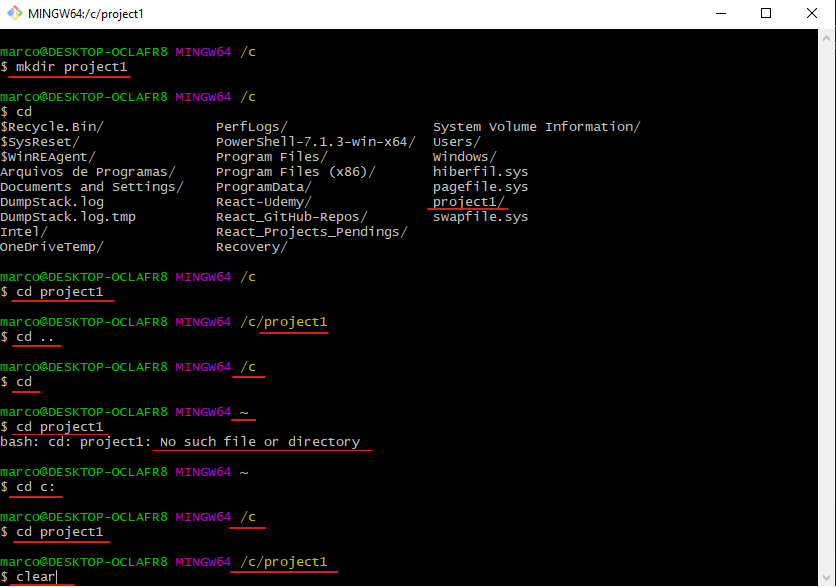
Make sure you're even into the folder, then run:

```js
npx create-react-app .
```

This dot `'.'` means you want to create the react applications into `this` folder.

#

#

#

### So, without further ado, let's go to next steps [ ... ]

## **Step 3**

### Enter the folder previously created by the command `npx create-react-app 'react_project_x_v2'`, along with the React application.

```js
cd react_project_x_v2
```

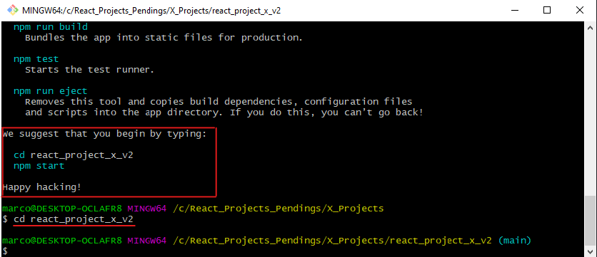

## **Step 4**

### Once into the folder, you also may call the VS Code IDE application by the command:

```js
code .
```

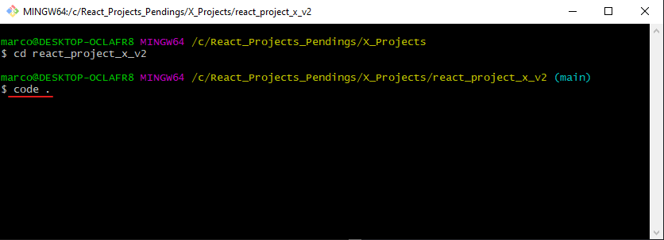\
Just to remember, this dot `'.'` means you're requiring this specific folder for exploring their files.

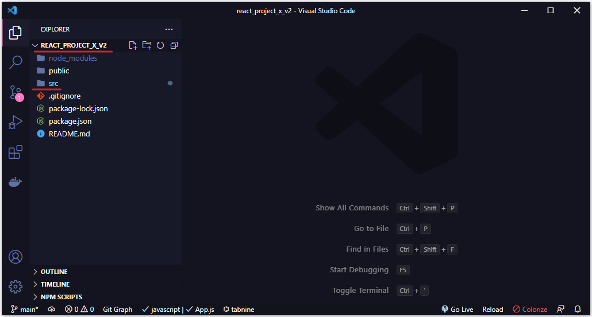
As you can see, your project is open and brings things created by React, but at first, the most important is the SCR (source) folder for starting coding.\
For seeing this application running and rendering in the web browser, you need to call the script :

```js
npm start
```

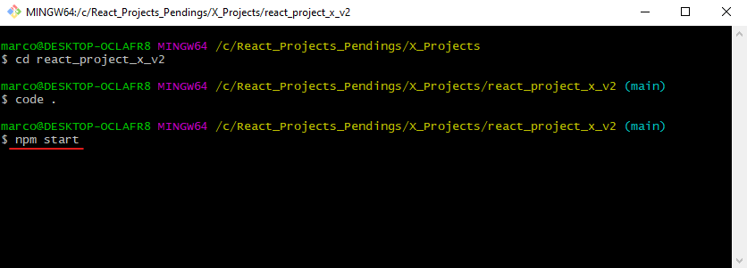

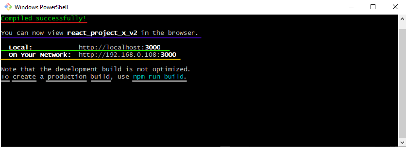

Underline legends:\
`Red`: Means that your project was compiled with no errors.\
`Blue`: It's quite an intuitive message: so, your project is running in the browser.\
`Green`: Local, means your application is available on your PC machine and can be got by the address `http://localhost:3000`.

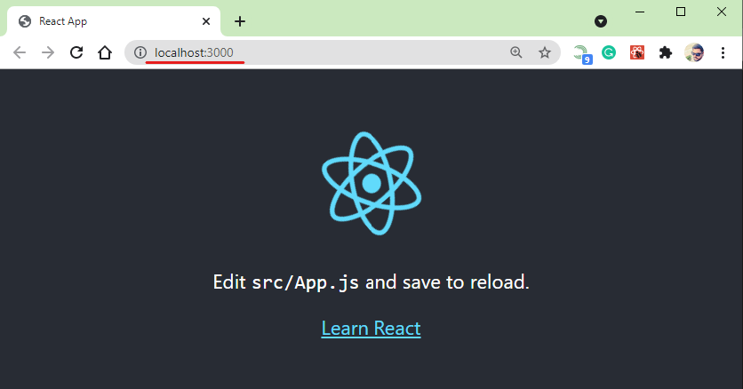

`Yellow`: On the other hand, your project is also available for other devices connected to the same network, by getting access through the address `http://192.168.0.108:3000`.\
Note: this IP changes according to your network configurations.


Note: Once the Git Bash terminal is rendering a server HTTP, it cannot be closed. Leave it running on the second plan by minimizing it down.

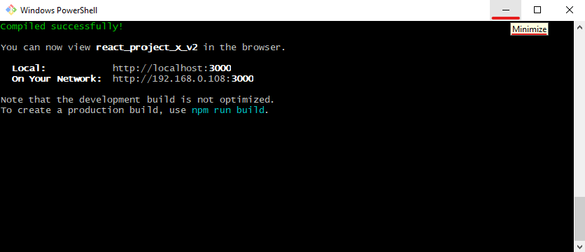

If you no longer want this running anymore, just `Ctrl+c` to stop it and your application won't be available until the next reload.

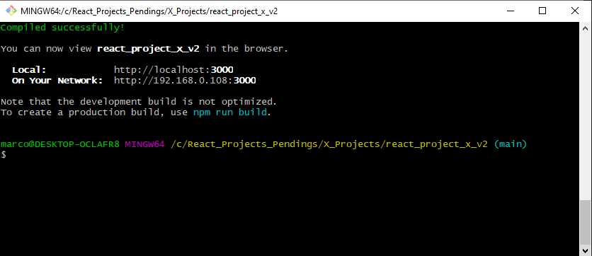

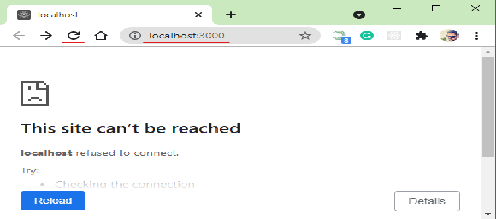

## Step 5

### Split your screen by docking your opened applications this following way, then expand the `src` folder, open the `App.js` file and begin for editing your code.

#

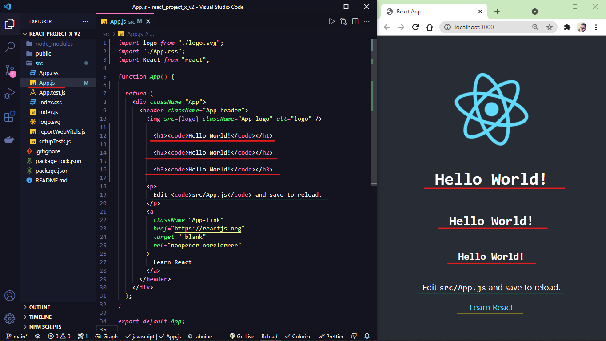

#

Seeing it on another device

#


#

# Standardizing

## Summary

### Basically, to stay on the same page along with the most professional coders regarding the way they're implementing their applications when coding, this tutorial introduces you to a standard configuration to get started a project which will be easier to be read and understand.

## Resources

- EditorConfig for VS Code
- Prettier - Code formatter
- ESLint 2.1.20
- Reload 0.0.6
- Prop-types (command line into terminal)

```js
npm i prop-types
```

## Step 1

### In the VS Code, go to extensions and search for `EditorConfig for VS Code` and confirm to install it.

#

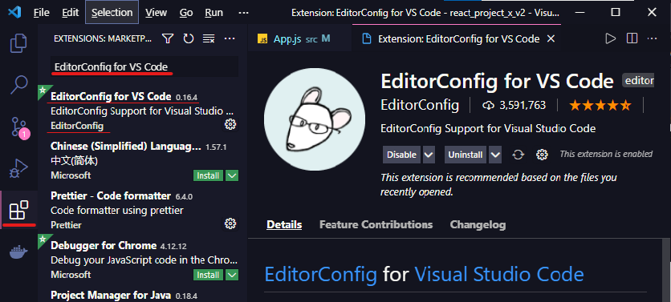

#

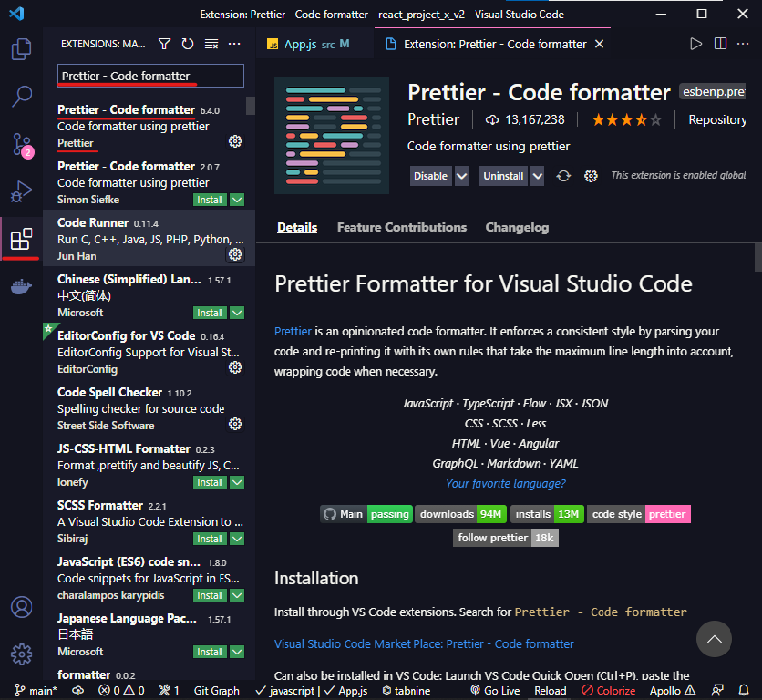

#

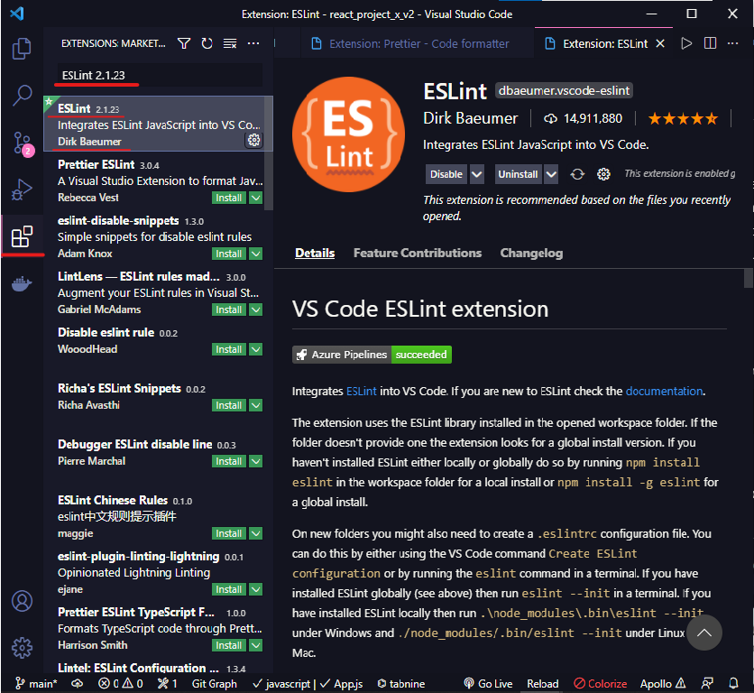

#

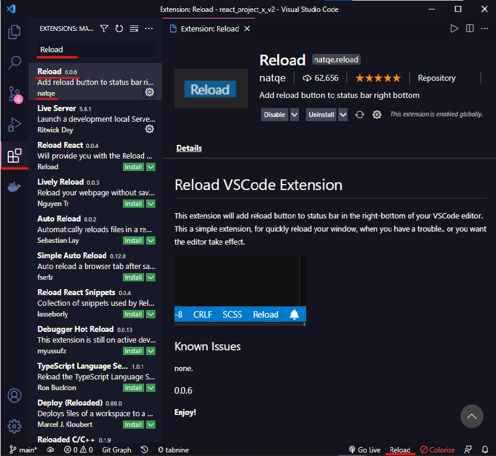

#

## Step 2

## After installing the extensions, back to the explorer area and start the following configurations to the first item from the Step 1.

### Click the right button of the mouse on the clear area, then `Generate .editorconfig`

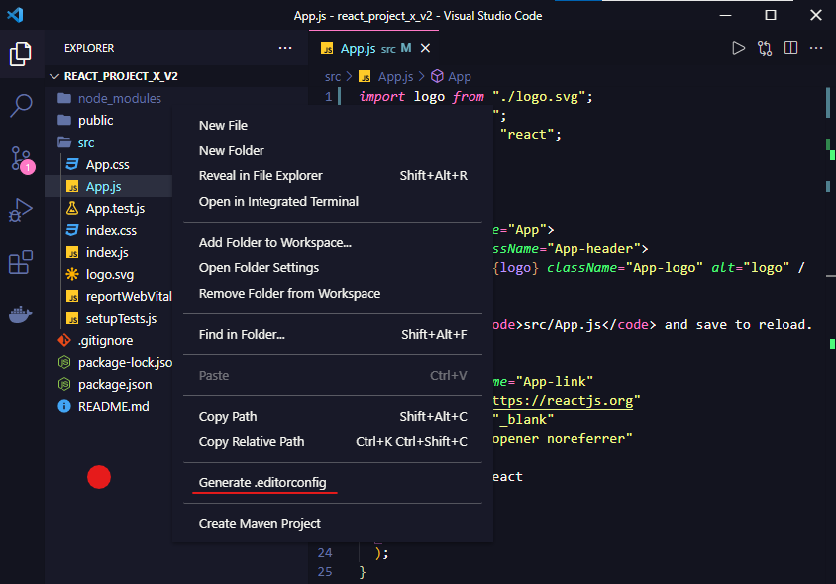

#

### Open the `.editorconfig` file.

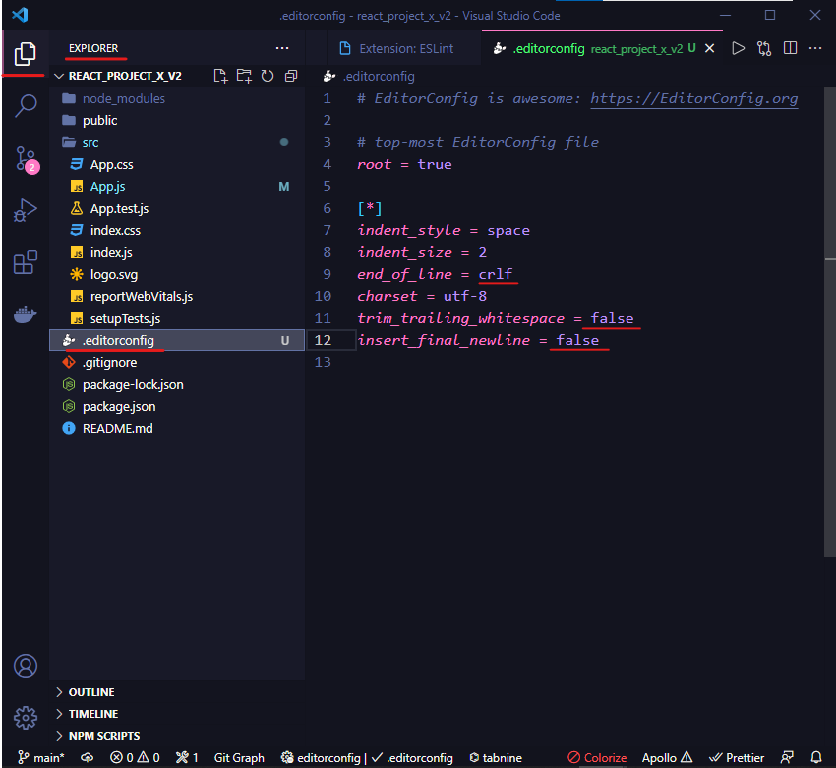

#

### Leave its configuration like this following way

```js
# EditorConfig is awesome: https://EditorConfig.org

# top-most EditorConfig file
root = true

[*]
indent_style = space
indent_size = 2
end_of_line = lf
charset = utf-8
trim_trailing_whitespace = true
insert_final_newline = true
```

### After that, `Ctrl+s` to save and then you can close it

#

## Step 3

### Let's go to the second one item from Step 1, `Prettier`.

#

### Click the button new file and type `.prettierrc.js`, then enter to confirm.

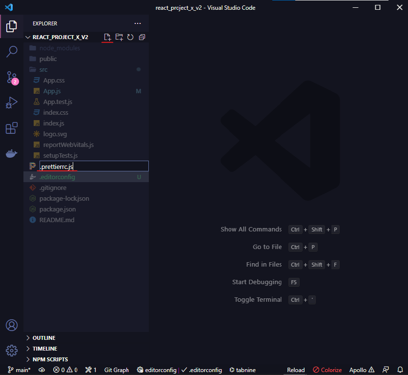
Click on this file earlier created to open, you'll see a blank body file, then copy and paste the following configuration.

```js
module.exports = {
  semi: true,
  trailingComma: "all",
  singleQuote: true,
  printWidth: 120,
  tabWidth: 2,
};
```

After pasting the configuration `Ctrl+s` to save, then you can close the file.
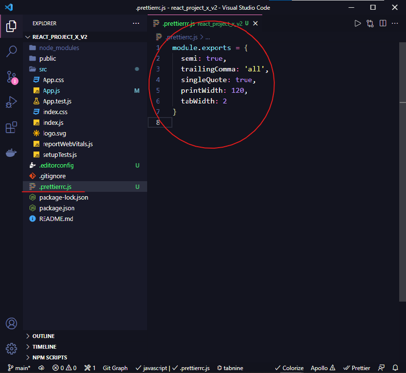

#

## Step 4

### Now let's go to the third one item from Step 1, `ESLint`.

There are several ways to create and configure the ESlint, just read its documentation for learning more. On the other hand, I'll show you one of the ways to create and configure the ESlint.\
Just click the button new file and type `.eslintrc.js`, then enter to confirm.

#

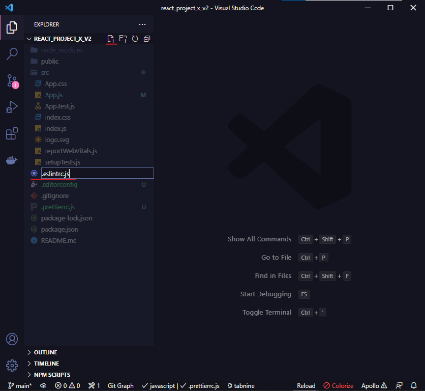

#

Click on this to open, in the blank body file, copy and paste the following.

```js
module.exports = {
  env: {
    browser: true,
    es2021: true,
    node: true,
    jest: true,
  },
  extends: [
    "eslint:recommended",
    "plugin:react/recommended",
    "plugin:react-hooks/recommended",
    "plugin:prettier/recommended",
  ],
  parserOptions: {
    ecmaFeatures: {
      jsx: true,
    },
    ecmaVersion: 12,
    sourceType: "module",
  },
  plugins: ["react"],
  settings: {
    react: {
      version: "detect",
    },
  },
  rules: {
    "react/react-in-jsx-scope": "off",
  },
};
```

#

After pasting the configuration `Ctrl+s` to save.

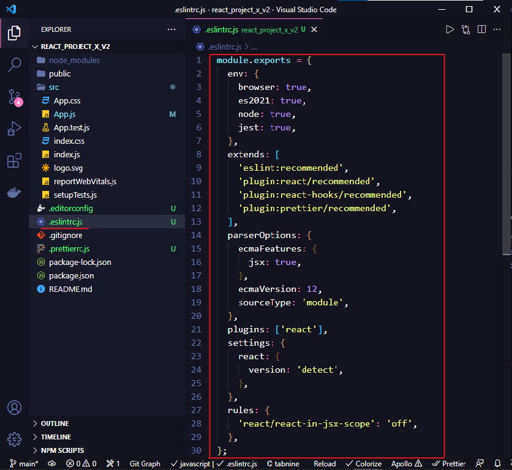

#

Now open the integrated terminal into VS Code just to check on how ESlint is running.

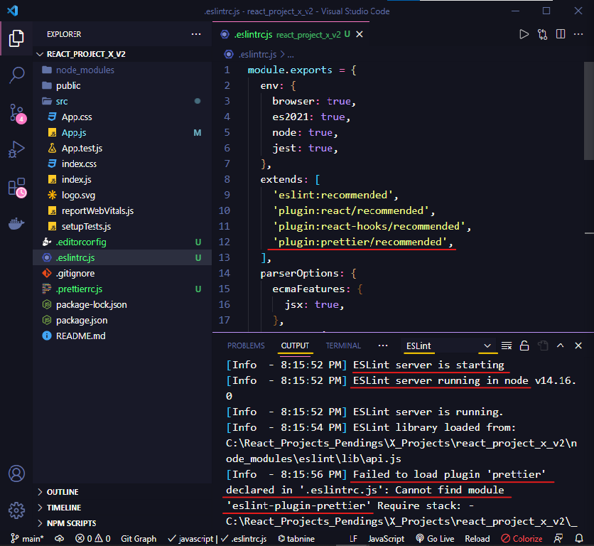

So, as we can see, the service is get started and running, but as the `plugin:prettier` is `recommended` it claims for.\
To solve this, alternate to `TERMINAL` and run the following command to install the required pluggin.

```js
npm i -D prettier eslint-config-prettier eslint-plugin-prettier
```

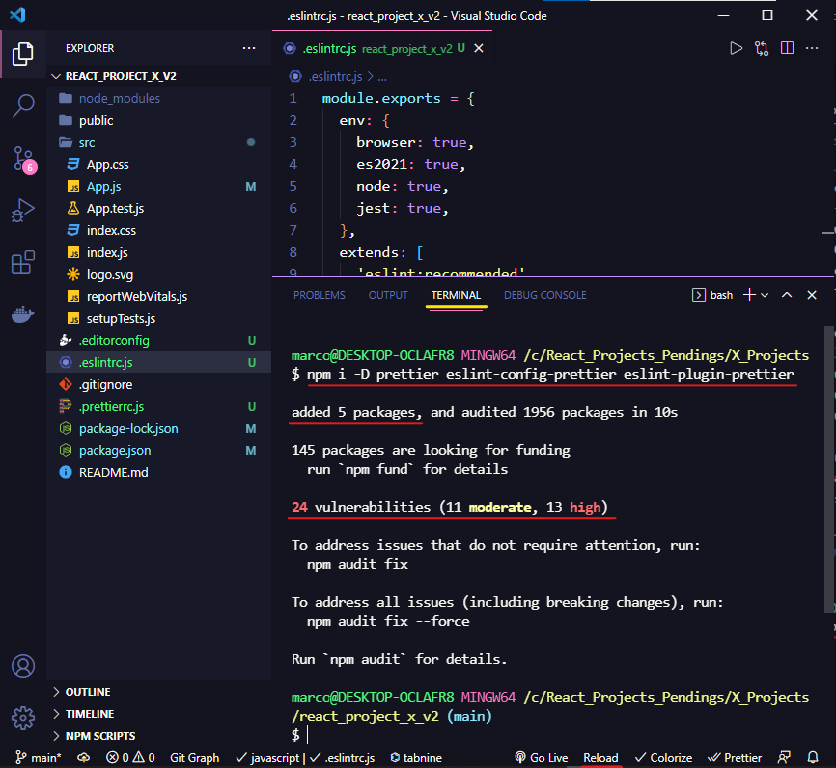

After that, click `Reload` just for rebooting it.

### Note: the `Reload` action doesn't affect what you're doing, and after the rebooting, the VS Code will continue from its previous state, but the script `npm start` stops running, so you have to call this again for each reboot.

#

So let's go back and check whether ESlint is now running well.\
Open VS Code terminal, go to the `OUTPUT` section, then in the `Tasks` list box, select ESLint just to see whether it's fully running.

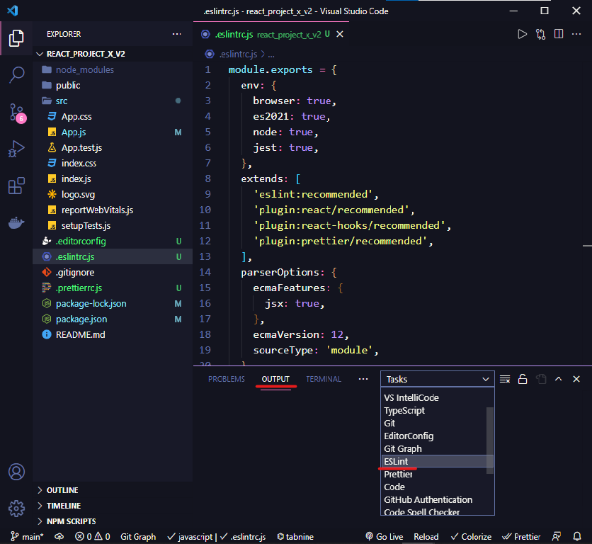

#

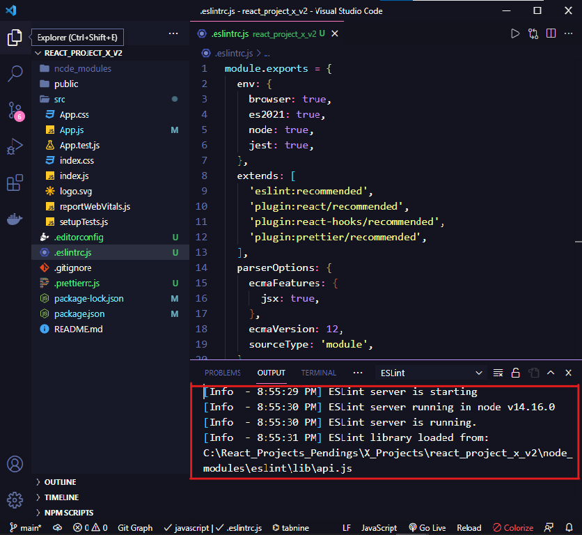
As you can see, no more claims. Now ESlint server is fixed.

#

## Step 5

### So, fails have been found!

These powerful tools are for standardizing your projects, note that after this you will find several errors to be corrected, as you have defined standards to be followed.\
You want your coding to be enjoyed more fluently and easier to understand; now Prettier will be in charge of that.

#

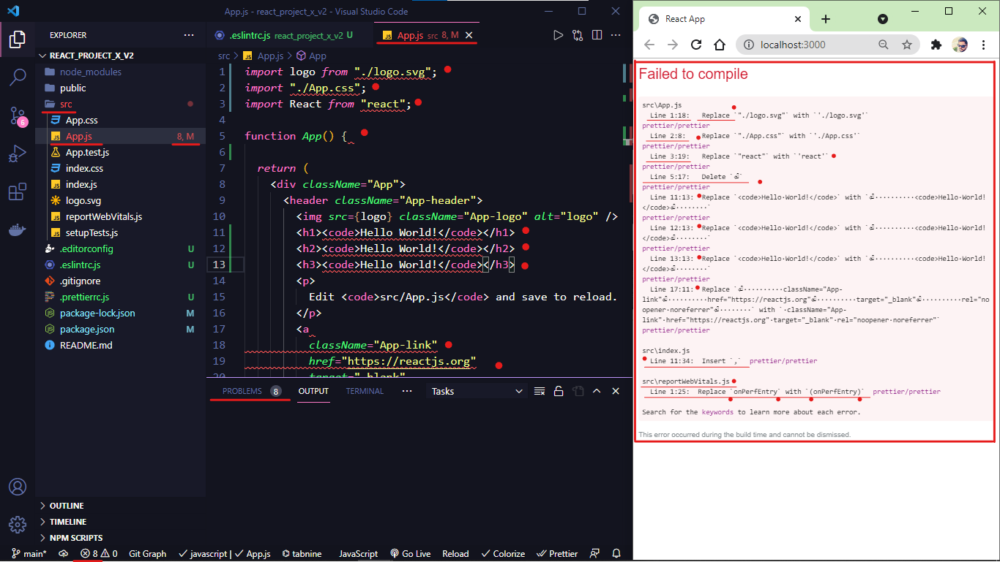

#

From this moment on, `Ctrl`+`s` will be your favorite command.

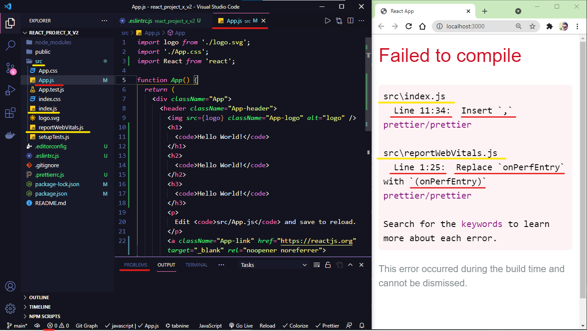

As you can see your code was auto-fixed and adjusted, but only for this current file. There's something more for making, for example as `scr\index.js` as `scr\reportWebVitals.js` is missing attention too, and it shows what has to be made.

### Therefore, what if it was a too large project?

So, run this command in the Terminal to fix them.

```js
npx eslint src/**/*.js --fix
```

The command above means:\
Look, go into my folder `src`/including `all` sub-folders/grab `all` files whose extension is `.js` --and `fix` them.\
So, set this up the way needed.\
Do this and reload your `web browser`. Now your page has been rendered successfully.

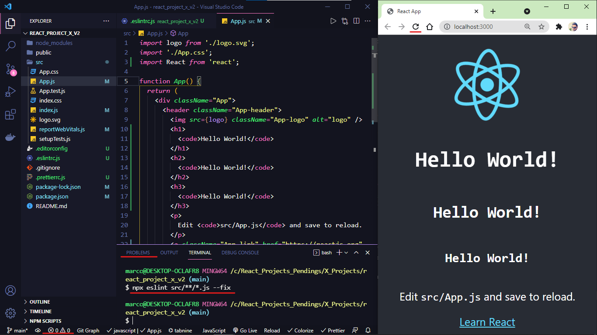

Thank to the powerful `codeActionsOnSave` configuration integrated into our file `config.json`, it's possible to auto-fix further errors like when to insert a comma, semicolon, or not [...]

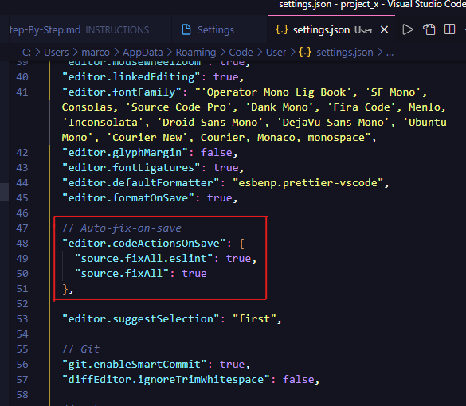

If you miss this, go to your `settings.json` file and insert these code lines wherever you want.

```js
"editor.codeActionsOnSave": {
    "source.fixAll.eslint": true,
    "source.fixAll": true
},
```

# [ `Ctrl`+`,` ] to open settings, then click on this icon 

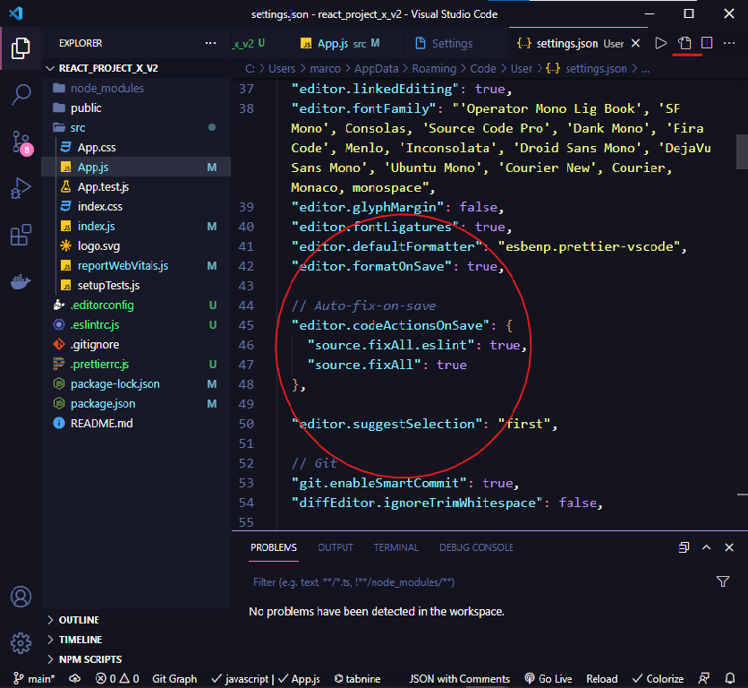

#

## Furthermore, you may need to segregate your variables through the command `import X from 'prop-types';` in the near future. You'll need to run this command.

```js
npm i prop-types
```

## Well, that's it for now. I hope I helped you guys. Cheers!!!
